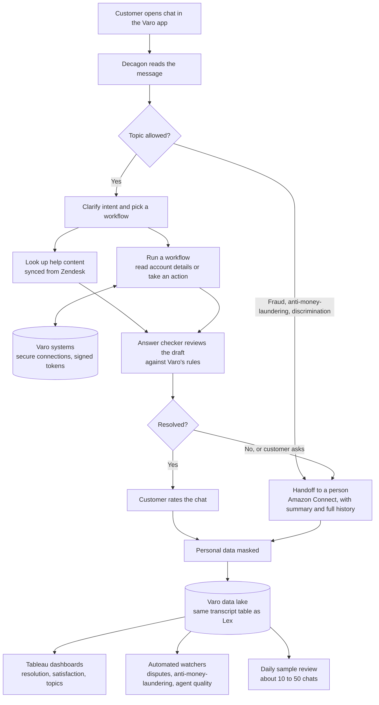

# Architecture at a glance

One picture of how a customer chat moves through the system, built from the [build phase](05-build-phase.md) and [production environment](07-production-environment.md) pages.

## Who owns what

| Layer | What it does | Owner | Source |
|---|---|---|---|
| Conversation | Understands the customer, picks a workflow, drafts the answer | Decagon platform, with workflows written by Varo | How Decagon works walkthrough, Feb 11, 2026 |
| Content | About 60 help articles turned into about 100 pieces of content, plus custom answers | Varo customer experience team | Varo: Decagon build review, Feb 26, 2026 |
| Account access | Reads account details and takes actions like closing an account | Varo engineering | Decagon Standup, Jan 16, 2026 |
| Safety | Answer checker, excluded topics, handoff rules | Varo rules, enforced in Decagon | How Decagon works walkthrough, Feb 11, 2026 |
| Handoff | Passes a summary and history to the human agent | Amazon Connect | Data pipeline planning, Jan 14, 2026 |
| Privacy | Masks personal data in logs | Google's data protection service | Decagon/Varo weekly, Feb 3, 2026 |
| Data | Every chat lands in the existing transcript table so old reports keep working | Varo data team | Weekly product review (Q3 planning), 2026 |
| Monitoring | Watchers, sample review, dashboards, a lean test set of about 30 questions | Varo data and customer experience teams | Data review, Nov 17, 2025; Varo: Decagon build review, Feb 26, 2026 |

## The design choice that mattered most

Decagon chats land in the same transcript table that Lex used. Every existing report kept working on day one, and the team could compare the old and new bots side by side without building anything new. Most of the proof in this repository depends on that one decision.
